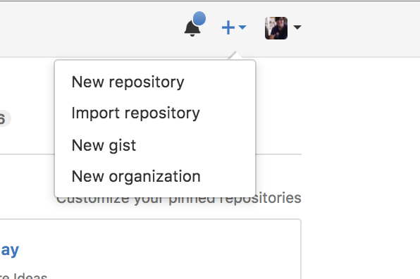
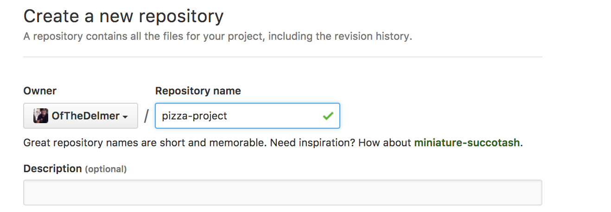
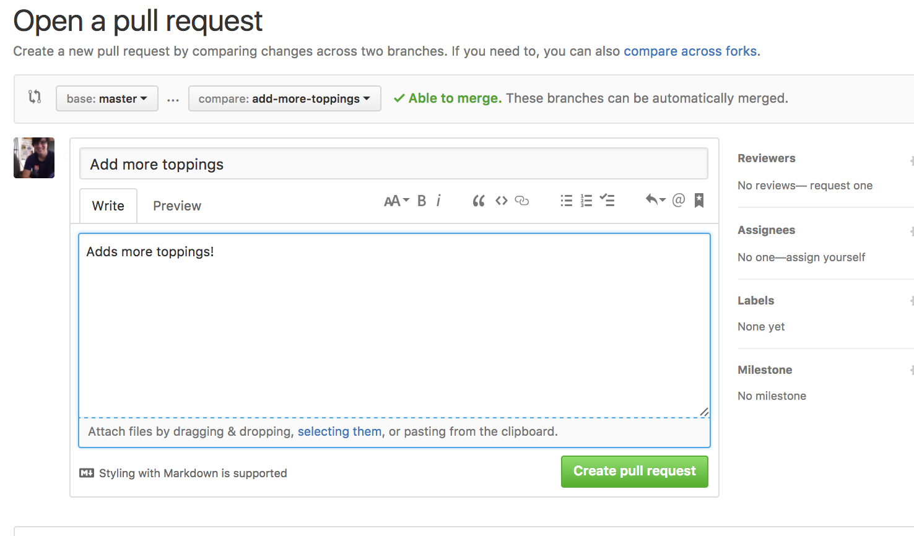

# LEARN TO CODE NYC
## Git Basics

<!-- toc -->

- [Overall Objectives](#overall-objectives)
- [Vocab/Discussion](#vocabdiscussion)
- [History](#history)
- [Crash Course Command Line](#crash-course-command-line)
  * [Exercises](#exercises)
- [Atom Tips](#atom-tips)
- [Git vs Github](#git-vs-github)
  * [GitHub Setup](#github-setup)
- [Local Git Usage](#local-git-usage)
  * [Init](#init)
  * [Quick Edits](#quick-edits)
  * [Git Commands](#git-commands)
    + [Status](#status)
    + [Diff](#diff)
  * [Add (Staging)](#add-staging)
    + [Discarding Changes](#discarding-changes)
  * [Commit](#commit)
    + [Commit Message Advice](#commit-message-advice)
  * [Exercises](#exercises-1)
- [Remote Setup](#remote-setup)
  * [Push](#push)
- [Exercises](#exercises-2)
- [Remote Changes](#remote-changes)
  * [Pull](#pull)
  * [Exercises](#exercises-3)
- [Branching](#branching)
  * [Rename](#rename)
  * [Checkout](#checkout)
  * [Delete](#delete)
  * [Exercises](#exercises-4)
- [Pull Request](#pull-request)
  * [Merging Branches](#merging-branches)
    + [Syncing](#syncing)
  * [Exercises](#exercises-5)
- [Conflicts](#conflicts)
  * [Exercises](#exercises-6)
- [WIP Commit and Amending](#wip-commit-and-amending)
- [Git Ignoring](#git-ignoring)

<!-- tocstop -->

## Overall Objectives

| Objectives |
| :--- |
| Describe and utilize the basics of git local version control: `staging`, `committing`, `branching`, and `remote syncing`.|
| Integrate GitHub as a remote repo and utilize it's tools for code review. |
| Discuss and utilize workflows for special git circumstances: `ammending` and `conflicts`. |

## Vocab/Discussion

* Repo or repository
* Local repository
* Remote repository
* Git
* GitHub
* GitHub Desktop
* Terminal

## History

Git was created by Linus Torvalds in 2005. It was intended to be a distributed version control system that was suitable for collaborationon the Linux Kernel. Then the Linux Kernel team had a falling out with a leading source control system, BitKeeper, which had been allowing them to utilize it for work on kernel. Other projects were around at that time, but lacked the distributed version control features that Torvalds liked from his experience with BitKeeper.  

## Crash Course Command Line

As a crash course in the command line go to your terminal and try the following.

**Create a directory**

```
mkdir example
```

**Change into the directory**

```
cd example
```

**Print the current directory**

```
pwd
```

**Quickly create an empty file**

```
touch hello.txt
```

**List the contents in the directory**

```
ls ./
```

The `./` represents the current directory

You can list the contents of the parent directory using `..`

```
ls ../
```

**Delete a File**

```
rm hello.txt
```

**Change into the parent directory**

```
cd ../
```

### Exercises

* Create a folder called `cats`.
* Change into the folder
* Create three files: `meowsers.txt`, `fluffers.txt`, and `whiskers.txt`.
* List the contents of the directory.
* List the content of the parent directory.
* Delete the `fluffers.txt` and `whiskers.txt`.
* Change into the parent directory of `cats` and then change back into it.

## Atom Tips

See the helpful notes on how to use [**Atom**](https://github.com/nyc-learn-to-code/learn_git/blob/master/atom_tips.md).

## Git vs Github

Just for clarification `Git` is the source control system for projects. GitHub is a web service that offers hosting for Git backed projects that offers teams tools and UI to help collaborate and track changes.

### GitHub Setup

Let's configure your machine with your GitHub info:

```
git config --global user.name "YOUR NAME"
```

Then add your github email address:

```
git config --global user.email "YOUR EMAIL ADDRESS"
```

Avoid entering your password with every GitHub interaction and do the following:

[Cache your password](https://help.github.com/articles/caching-your-github-password-in-git/)


> Alternatively you can [use these instructions](https://help.github.com/articles/generating-a-new-ssh-key-and-adding-it-to-the-ssh-agent/) for setting up SSH with GH if you won't have troubles communicating over that port in your primary place of development.

## Local Git Usage

### Init

To start a new project make a new project folder.

```
mkdir pizza
```

And change into it.

```
cd pizza
```

Then initialize a new git project in that directory.

```
git init
```

If you list your directory's folders you should see the new `.git` folder.

```
ls -a
```

This is where git stores all your local changes. You can look at it by listing its contents.

```
ls -a .git
```

You should see the following structure.

```
	COMMIT_EDITMSG
	FETCH_HEAD
	HEAD
	ORIG_HEAD
	branches
	config
	description
	hooks
	index
	info
	logs
	objects
	refs
```

We won't cover how git uses these, but it's cool to see it's all right there.

### Quick Edits

Open the project in `atom` by typing the following:

```
atom .
```

Create a new file called `README.md` by clicking the lefthand project space and hit `SHIFT + A` and typing the name `README.md`.


In your `README` file add the following.

`README.md`

```markdown
# Learn To Code
## Love For Pizza

My favorite pizza toppings are...

```

Then save the file.

### Git Commands

#### Status

If you're making edits or you are unsure about what you've done in your project the `git status` will help you get a quick idea.

```
git status
```

It should print out a helpful update of the files changed and tracked so far.

```
On branch master

Initial commit

Untracked files:
  (use "git add <file>..." to include in what will be committed)

    README.md
```

Here it's telling us we haven't tracked our new `README.md` file and that we are working toward our `Initial commit`.

#### Diff 

If you are wondering what changed you can view this easily using `git diff`. You should see the following.

We'll revisit this once we've got a history of changes to compare against. You can try running it now, but you're not going to see anything.

### Add (Staging)

Let's start tracking our changes to the `README`

```
git add README.md
```

The pattern here is just `git add <your_file_path>`. This allows git to cache the current set of changes to a file. 

If you run `git status` you should see the following:

```
On branch master

Initial commit

Changes to be committed:
  (use "git rm --cached <file>..." to unstage)

    new file:   README.md
```

See how `README.md` is no longer under the `Untracked files:` list. You can also continue to make changes and rest assured the cached file can be recovered.

You can also now view the file changes in the cache using `git diff`.

```
git diff --cached
```

#### Discarding Changes

If you've made some unwanted changes to a file since your last staging then you recover the cached version easily. For example, if you delete the cached file accidentally.

```
rm README
```

Then you can observe it is gone by running git status and observing the `Changes not staged for commit`.

```
Changes not staged for commit:
  (use "git add/rm <file>..." to update what will be committed)
  (use "git checkout -- <file>..." to discard changes in working directory)

    deleted:    README.md
```

You can then recover the deleted file by checking it out from the cache.

```
git checkout -- README.md
```

### Commit

Once we have staged our changes we are ready to create a savepoint/commit.

* **Commit**: A commit stores the current contents of your project with message describing the changes. The message that goes along with a commit is called a **Commit Message**.

 > **ATOM TIP**: If you create new files that need to be committed in Atom then they will show up as green. It's a nice reminder.

Let's commit the file you edited. 

```
git commit
```

Fill out the **Summary** and **Description** of the changes then click **Commit to master**.


A good first commit can read as follows:

* Summary: Add project readme.
* Description: Adds a readme with a list of my favorite pizza toppings.

In git the first line is the summary followed by a new line and then description.

```
Add project readme

Adds a readme with a list of my favorite pizza toppings.
```

#### Commit Message Advice
 
A Good commit message summary always starts with a **verb** describing the change in an imperative form:

* `Add a project readme`
* `Remove old comments in code`
* `Update project dependancies`
* `Fix search logic to include cute kittens`
* `Refactor legacy search logic`

Avoid other verb forms

* `Removing old comments`
* `Updated project dependancies`
* `More fixes to help searching for kittens`

Use your message description to explain **why** you are making the change. Briefly describe what changed also.

### Exercises

* Update your README with your three favorite toppings 
* View the status of the changes you made
* View the diff of changes 
* Stage the new toppings added to the README
* View the status of the changes and verify it was staged
* Commit the changes with a good **Summary** and **Description**.
* View the status and verify there is nothing untracked or cached.
* Use `git show` to view the changes you made in the last commit.
* Use `git log` to view the commits you've made.

## Remote Setup

Recall that GH is going to host our remote. Thus we'll need to create a new GitHub **New Repository** on GitHub for our pizza app.



Click the plus sign in the upper righthand side of your GH header and select new repository



Give the repo the name `pizza-project`. 

Copy the link for the GH repo and add it as your project remote.

```
git remote add origin <YOUR_GITHUB_REPO_URL>
```

Check that your remote was added by checking your remote info.

```
git remote --verbose
```

### Push

Now that your remote has been added your can confidently push to your `origin`.

```
git push origin master 
```

Here we are saying

```
git push <REMOTE_NAME> <BRANCH_NAME>
```

Our `origin` is the repo we just created and the `master` branch is the default branch for all git work.

Go to your GitHub repo and verify that your changes were pushed.

## Exercises

* Quick Review:
	* Edit your `README.md` to include two more pizza toppings.
	* Stage and commit the change.
	* Push it and verify that it was properly pushed.
* Workflow review:
	* Switch to the parent directory `cd ../`
	* Create a new folder called `favorite_cars`
	* Change into it and initialize a new repo.
	* Create a README with your three favorite cars
	* Commit the changes
	* Create a GitHub repo called `cars-project`
	* Add the remote origin for that GH repo
	* Push to GitHub
	* Verify those changes were commited.

## Remote Changes

### Pull 

### Exercises

## Branching

### Rename

### Checkout

### Delete

### Exercises

## Pull Request

Click the compare and pull request button. Then give the pull request a title and description.



You should always review your file changes before to spot errors. Create a commit and sync it.

If there aren't any errors click the `Create Pull Request` button. Once you have an open pull request someone can begin reviewing your changes and click the `merge pull request` button.


### Merging Branches

You are the only one working on this project, so just leave a comment like `LGTM` and click merge.

Once you have merged you'll be asked if you want to delete the branch. Click `delete branch` so you don't have a bunch of branches hanging around.


#### Syncing

Now that you merged your remote changes you need to tell your `master` branch retrieve the added commits.

To change back to the master branch we just `checkout` our `master`.

```
git checkout master
```

> Note: if you have unsaved changes to tracked files you'll not be able to change branches. See the **WIP COMMIT** section or lookup **Git Stashing**.

Then `pull` the changes from the `origin master`.

```
git pull --rebase origin master 
```

Then we will need to delete our local branch.

```
git branch -d add-more-toppings
```

Now you are up to date and your local repo is tidy.

### Exercises

## Conflicts

### Exercises

## WIP Commit and Amending

## Git Ignoring

